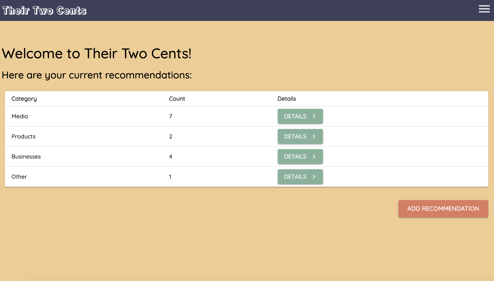

# Their Two Cents

## Description

Duration: 2 week sprint

Created a recommendation management application, Their Two Cents, using React, Redux, and Redux Sagas. A user can login and view recommendations given to them by friends and family so they don't forget! Recommendations are organized by four categories: media, business, product, and other. There are additional views to add a recommendation by category and add some notes, as well as a favorites page so the user can save their favorite recommendations all in one place. Recommendations can also be deleted. I had alot of fun learning Material UI basics for this application as well.

A deployed version of this app can be found here: (ADD ONCE DEPLOYED)

## Screen Shot

## Prerequisites

You will need this software installed to run this project:

- [Node.js](https://nodejs.org/en/)
- [PostrgeSQL](https://www.postgresql.org/)
- [Nodemon](https://nodemon.io/)

## Installation

- Create a database named 'their-two-cents'
- The queries in the 'database.sql' file are all set up for you - this project was built in Postgres, so you will need to have that installed. I used Postico to run my queries and test my data.
- Open your code editor and run `npm install`
- Run `npm run server`
- Run `npm run client`
- Navigate to `localhost:3000`

## Built With:

- React, Redux, Redux Sagas, PostgreSQL, Passport, Material UI.

## Acknowledgement
Thanks to my instructors Chris, Liz, Dane, and Kris and everyone at Prime Digital Academy for helping me learn the technical skills to build this!

## Support
If you have feedback or issues with the app, please reach out to me at sarah.helgen@gmail.com

